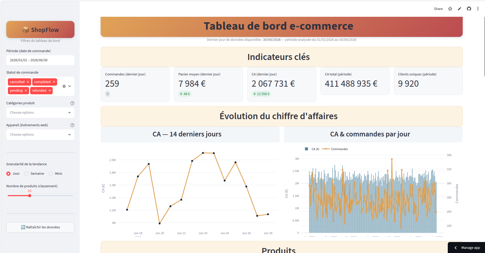
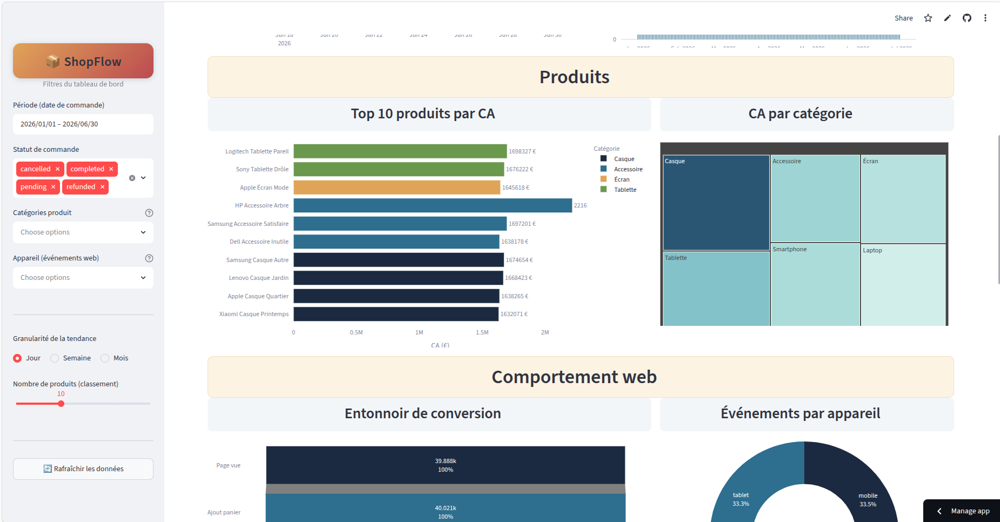
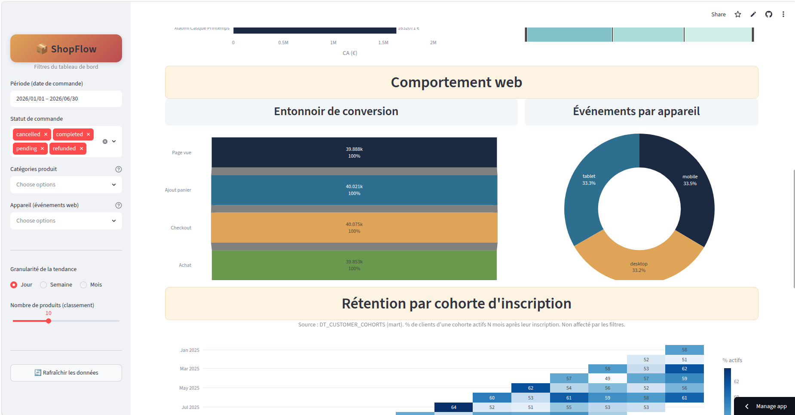
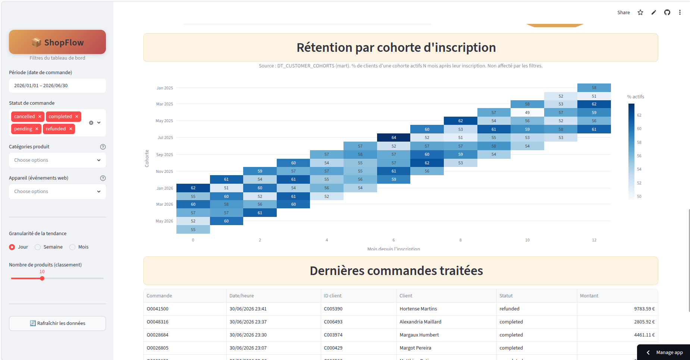

# ShopFlow — Pipeline analytique e-commerce end-to-end sur Snowflake

Plateforme data **RAW → STAGING → MARTS** construite sur Snowflake pour la boutique
e-commerce fictive **ShopFlow** : ingestion de données structurées et semi-structurées,
pipeline automatisé (Streams + Tasks), marts analytiques (Dynamic Tables), Time Travel,
et restitution dans un **dashboard Streamlit + Plotly**.

> Projet fil rouge Snowflake (5 jours) — badges Data Warehousing, Data Lake & Data Engineering.
> L'énoncé d'origine est archivé dans [`docs/`](docs/) *(le cas échéant)* ; ce README documente la **solution livrée**.

---

## 1. Contexte

ShopFlow génère chaque jour quatre flux de données déposés sur un stage :

| Source | Format | Volume | Contenu |
|---|---|---|---|
| `orders.csv` | CSV (headers, `,`) | ~50 000 | commandes (id alphanumérique, date+heure, statut, montant) |
| `order_items.csv` | CSV | ~150 000 | lignes de commande (produit, quantité, prix) |
| `customers.parquet` | Parquet snappy | ~10 000 | référentiel client (CRM) |
| `products.json` | JSON (array) | ~500 | catalogue produits + attributs imbriqués + tags |
| `web_events.json` | JSON (NDJSON) | ~200 000 | événements web (page vue, panier, checkout, achat) |

Les données sont ingérées en deux lots : **J1** (chargement initial) puis **J2** (arrivage du
« lendemain », qui sert à démontrer que le pipeline Streams/Tasks capte l'incrémental).

## 2. Architecture

```
              ┌───────────────────────────────────────────────┐
              │  Stage interne  RAW.STAGE_LANDING              │
              │  /j1  (chargement initial)                     │
              │  /j2  (arrivage incrémental, Jour 3)           │
              └───────────────────────┬───────────────────────┘
                                      │ COPY INTO (CSV / Parquet / JSON→VARIANT)
                                      ▼
              ┌───────────────────────────────────────────────┐
              │  SCHEMA RAW  — landing, données brutes         │
              │  ORDERS_RAW · ORDER_ITEMS_RAW · CUSTOMERS_RAW  │
              │  PRODUCTS_RAW(VARIANT) · WEB_EVENTS_RAW(VARIANT)│
              └───────────────────────┬───────────────────────┘
                                      │ STREAMS (CDC, APPEND_ONLY)  +  backfill J1
                                      │ STR_ORDERS · STR_ORDER_ITEMS · STR_WEB_EVENTS
                                      ▼
              ┌───────────────────────────────────────────────┐
              │  SCHEMA STAGING — nettoyé / typé / enrichi     │
              │  STG_ORDERS · STG_ORDER_ITEMS · STG_WEB_EVENTS │
              │  STG_PRODUCTS · STG_CUSTOMERS                  │
              │  alimenté par un DAG de 4 TASKS (5 min)        │
              └───────────────────────┬───────────────────────┘
                                      │ DYNAMIC TABLES (TARGET_LAG = 5 min)
                                      ▼
              ┌───────────────────────────────────────────────┐
              │  SCHEMA MARTS — agrégats métier                │
              │  DT_DAILY_REVENUE · DT_TOP_PRODUCTS            │
              │  DT_CUSTOMER_COHORTS                           │
              └───────────────────────┬───────────────────────┘
                                      ▼
              ┌───────────────────────────────────────────────┐
              │  Dashboard Streamlit + Plotly  (streamlit/)    │
              └───────────────────────────────────────────────┘
```

**Graphe de tasks (DAG)** — seule la racine porte un `SCHEDULE`, les enfants s'enchaînent via `AFTER` :

```
TSK_LOAD_STG_PRODUCTS  (racine, SCHEDULE 5 min, full refresh des produits)
     ├── TSK_LOAD_STG_ORDERS        (AFTER · consomme STR_ORDERS)
     │        └── TSK_LOAD_STG_ORDER_ITEMS (AFTER · consomme STR_ORDER_ITEMS, enrichit)
     └── TSK_LOAD_STG_WEB_EVENTS     (AFTER · consomme STR_WEB_EVENTS)
```

## 3. Prérequis Snowflake

| Élément | Valeur | Rôle |
|---|---|---|
| **Compte** | un compte Snowflake (ex. `ab12345.eu-west-1`) | — |
| **Rôle setup** | `ACCOUNTADMIN` | création DB, warehouses, rôle, grant `EXECUTE TASK` |
| **Rôle applicatif** | `SHOPFLOW_ENGINEER` | exécution quotidienne du pipeline |
| **Base** | `SHOPFLOW_DB` → schémas `RAW`, `STAGING`, `MARTS` | — |
| **Warehouse ingestion** | `WH_INGEST` — XSMALL, `AUTO_SUSPEND = 60`, `INITIALLY_SUSPENDED` | COPY INTO |
| **Warehouse transformation** | `WH_TRANSFORM` — SMALL, `AUTO_SUSPEND = 60` | Tasks & Dynamic Tables |
| **Stage** | `RAW.STAGE_LANDING` (interne) | dépôt des fichiers sources |

> Le rôle `SHOPFLOW_ENGINEER` est créé et grante automatiquement par le script `01`.
> Adaptez la ligne `GRANT ROLE SHOPFLOW_ENGINEER TO USER ABRAHAMKOLOBOE;` à votre utilisateur.
> Contrainte de coûts : tous les warehouses ont `AUTO_SUSPEND ≤ 60 s` et sont suspendus en fin de chaque script.

## 4. Instructions de reproduction

Les scripts sont **rejouables** et doivent être exécutés **dans l'ordre**. Chaque étape d'upload
se fait dans Snowsight : *Data → SHOPFLOW_DB → RAW → Stages → STAGE_LANDING → + Files*.

```text
┌── Jour 1 ─────────────────────────────────────────────────────────────────┐
│ 1. Uploader dans @RAW.STAGE_LANDING/j1/ :                                   │
│      orders.csv · order_items.csv · customers.parquet                       │
│ 2. Exécuter  sql/01_setup_and_ingest.sql   (rôle ACCOUNTADMIN)              │
│    → DB, schémas, warehouses, rôle, stage, file formats, tables RAW, COPY   │
└─────────────────────────────────────────────────────────────────────────────┘
┌── Jour 2 ─────────────────────────────────────────────────────────────────┐
│ 3. Uploader dans @RAW.STAGE_LANDING/j1/ :  products.json · web_events.json  │
│ 4. Exécuter  sql/02_semi_structured.sql                                     │
│    → FF_JSON, PRODUCTS_RAW & WEB_EVENTS_RAW (VARIANT), requêtes FLATTEN,     │
│      pattern data-lake (lecture directe sur stage)                          │
└─────────────────────────────────────────────────────────────────────────────┘
┌── Jour 3 ─────────────────────────────────────────────────────────────────┐
│ 5. Exécuter  sql/03_streams_tasks.sql  jusqu'à la section 6                 │
│    → tables STAGING, streams, backfill J1, DAG de 4 tasks activé            │
│ 6. Uploader dans @RAW.STAGE_LANDING/j2/ :                                   │
│      orders_j2.csv · order_items_j2.csv · web_events_j2.json                │
│ 7. Exécuter la section 7 (test dynamique) : COPY J2 → streams se remplissent│
│      → EXECUTE TASK racine → STAGING mis à jour, streams reconsommés         │
└─────────────────────────────────────────────────────────────────────────────┘
┌── Jour 4 ─────────────────────────────────────────────────────────────────┐
│ 8. Exécuter  sql/04_marts_and_timetravel.sql                                │
│    → 3 Dynamic Tables (MARTS) + exercice Time Travel (DELETE → recovery)    │
└─────────────────────────────────────────────────────────────────────────────┘
┌── Jour 5 ─────────────────────────────────────────────────────────────────┐
│ 9. Réactiver les objets suspendus en fin de Jour 4 :                        │
│      ALTER DYNAMIC TABLE MARTS.DT_DAILY_REVENUE     RESUME;                  │
│      ALTER DYNAMIC TABLE MARTS.DT_TOP_PRODUCTS      RESUME;                  │
│      ALTER DYNAMIC TABLE MARTS.DT_CUSTOMER_COHORTS  RESUME;                  │
│10. Lancer le dashboard → voir streamlit/README.md                          │
└─────────────────────────────────────────────────────────────────────────────┘
```

### Dashboard

Le dashboard lit les schémas `STAGING` et `MARTS`. Deux modes de connexion :

- **Streamlit in Snowflake** — session active, aucun credential.
- **En local** :
  ```bash
  cd streamlit
  pip install -r requirements.txt
  cp .streamlit/secrets.toml.example .streamlit/secrets.toml   # puis renseigner le compte
  streamlit run streamlit_app.py
  ```

Détails complets (sections, filtres, dépannage) : **[streamlit/README.md](streamlit/README.md)**.

## 5. Screenshots

### Ingestion & couche RAW (Snowsight)

| Vue | Capture |
|---|---|
| Tables RAW (vue d'ensemble) | [`screenshots/raw/shop_flow_raw_tables_overview.png`](screenshots/raw/shop_flow_raw_tables_overview.png) |
| Stage `STAGE_LANDING` (lot J1) | [`screenshots/raw/stages/j1.png`](screenshots/raw/stages/j1.png) |
| File formats | [`screenshots/files_formats/ff.png`](screenshots/files_formats/ff.png) |
| Tables détaillées | [`orders`](screenshots/raw/tables/orders.png) · [`order_item`](screenshots/raw/tables/order_item.png) · [`customers`](screenshots/raw/tables/customers.png) · [`products`](screenshots/raw/tables/products.png) · [`web_events`](screenshots/raw/tables/web_events.png) |

### Dashboard Streamlit

Indicateurs clés et évolution du chiffre d'affaires (KPI + CA 14 jours + CA & commandes par jour) :



Produits (Top 10 par CA + treemap du CA par catégorie) et début de la section comportement web :



Comportement web : entonnoir de conversion et répartition par appareil :



Rétention par cohorte d'inscription (heatmap, source `DT_CUSTOMER_COHORTS`) et dernières commandes traitées :



## 6. Points de vigilance rencontrés

Difficultés réelles rencontrées pendant le projet et décisions de conception à défendre :

**Ingestion (J1–J2)**
- **IDs alphanumériques & dates avec heure.** Les identifiants sont `O0000001` / `C005654` (pas numériques) et `order_date` contient date **+** heure → colonnes ID en `VARCHAR`, `ORDER_DATE` en `TIMESTAMP_NTZ`. *Leçon : toujours prévisualiser un fichier à travers son file format avant de figer le schéma.*
- **`METADATA$FILENAME` instable.** Provoque l'erreur interne `$METADATA$kFilename` sur certains environnements → `_SOURCE_FILE` est rempli par un littéral (chaque COPY cible un fichier précis).
- **`ERROR_ON_COLUMN_COUNT_MISMATCH = FALSE`** requis : les tables RAW ont 2 colonnes d'audit (`_LOADED_AT`, `_SOURCE_FILE`) de plus que les fichiers.
- **Stage en `IF NOT EXISTS`, jamais `OR REPLACE`** : un `OR REPLACE` effacerait tous les fichiers déjà uploadés.

**Semi-structuré (J2)**
- **`STRIP_OUTER_ARRAY = TRUE`** indispensable pour `products.json` (array → 1 ligne par produit). Sans effet sur le NDJSON de `web_events.json`, donc un seul file format JSON suffit.
- **Champ `tags` absent de l'énoncé** découvert à l'aperçu → `LATERAL FLATTEN(... OUTER => TRUE)` pour ne pas perdre les produits sans tag.
- **External tables = stages externes uniquement** (S3/GCS/Azure). Le stage étant interne, on démontre le **pattern data-lake équivalent** (requête directe sur le fichier en stage, sans copie) ; la DDL external table reste fournie en commentaire pour un bucket cloud.

**Pipeline Streams & Tasks (J3)**
- **4 tasks, pas 3.** L'énoncé nomme 3 tasks mais il y a 3 streams dont `STR_ORDER_ITEMS` : un stream non consommé s'accumule indéfiniment → ajout de `TSK_LOAD_STG_ORDER_ITEMS`.
- **Streams = incrémental, d'où un backfill initial.** J1 est déjà dans RAW ; un stream créé ensuite ne voit que le postérieur (J2). On backfill donc STAGING avec J1 par lecture directe de RAW → pas de double-comptage.
- **`products` & `customers` = données de référence** (pas de stream) : products rafraîchi en full par la task racine, customers chargé une fois.
- **Ne pas relancer le script `01` après la pose des streams** : recréer une table RAW (`CREATE OR REPLACE`) invaliderait les streams posés dessus.
- **`GRANT EXECUTE TASK ON ACCOUNT`** obligatoire (ACCOUNTADMIN), sinon le `RESUME`/`EXECUTE` échoue en *insufficient privileges*.
- **`WHEN SYSTEM$STREAM_HAS_DATA(...)`** sur chaque task enfant : économie de crédits (task ignorée si rien à traiter).

**Marts & Time Travel (J4)**
- **Fenêtre « 30 derniers jours » ancrée sur `MAX(ORDER_DATE)`**, pas sur `CURRENT_DATE` : le dataset est synthétique (fév.→juin 2026), un filtre relatif à aujourd'hui ne renverrait quasi rien.
- **Time Travel + stream append-only.** La restauration réinsère des lignes que le stream recapterait comme de nouveaux inserts → on **recrée le stream** après recovery pour éviter la duplication.

**Coûts**
- Warehouses, graphe de tasks et Dynamic Tables sont **suspendus en fin de chaque journée**. Les DT restent interrogeables une fois suspendues (données du dernier refresh) mais doivent être **réactivées (`RESUME`) avant le dashboard**.

## 7. Structure du dépôt

```
shopflow/
├── README.md                       # ce fichier
├── data/                           # dataset synthétique
│   ├── j1/                         # lot initial (orders, order_items, customers, products, web_events)
│   └── j2/                         # arrivage incrémental (orders_j2, order_items_j2, web_events_j2)
├── sql/
│   ├── 01_setup_and_ingest.sql     # DB, schémas, WH, rôle, stage, ingestion structurée
│   ├── 02_semi_structured.sql      # JSON/VARIANT, FLATTEN, pattern data-lake
│   ├── 03_streams_tasks.sql        # streams, backfill, DAG de tasks, test J2
│   └── 04_marts_and_timetravel.sql # dynamic tables + Time Travel
├── streamlit/                      # dashboard (voir son propre README)
│   ├── streamlit_app.py
│   ├── requirements.txt
│   ├── README.md
│   └── .streamlit/secrets.toml.example
├── screenshots/                    # captures Snowsight (+ dashboard à ajouter)
└── slides/                         # support de soutenance
```

## 8. Ressources

- [Streams](https://docs.snowflake.com/en/user-guide/streams-intro) ·
  [Tasks](https://docs.snowflake.com/en/user-guide/tasks-intro) ·
  [Dynamic Tables](https://docs.snowflake.com/en/user-guide/dynamic-tables-about) ·
  [Time Travel](https://docs.snowflake.com/en/user-guide/data-time-travel)
